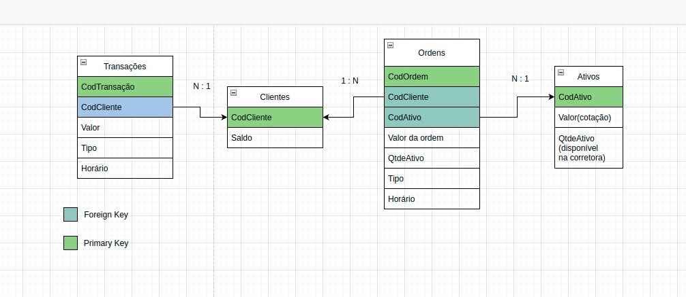
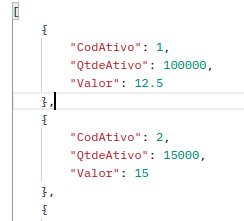
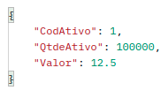
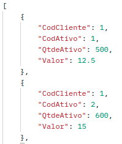
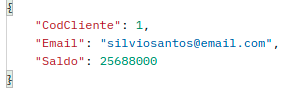
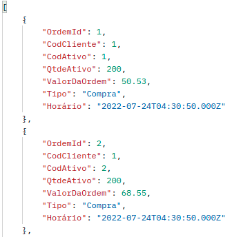

# App de Investimentos Backend - Processo Seletivo XP

Esse projeto consiste em uma API REST que retornaria informações para o front-end. Dentre elas estão compra e venda de ativos, saques, depósitos
e qualquer outra operação que um cliente poderia executar em um aplicativo financeiro.

  
<strong>Tecnologias utilizadas:</strong>
 
  <ul> 
    <li>Typescript</li>
    <li>Sequelize</li>
    <li>Express</li>
    <li>Docker</li>
    <li>Bcrypt</li>
    <li>Json Web Token</li>
    <li>Mocha</li>
    <li>Chai</li>
  </ul>

  
<strong>Como rodar a aplicação:</strong>
 
 Como a aplicação utiliza um banco de dados local será necessário rodar um container Docker com uma imagem MySQL para conseguir realizar as requisições.
   
 A API rodará na porta 3000 por padrão mas pode ser definida no .env como PORT.
   
 Caso já tenha MySQL localmente na máquina, poderá utilizá-lo criando um .env passando os valores 
 para as seguintes variáveis: DB_USERNAME, DB_PASSWORD,  DB_HOST, DB_PORT.
  
 <h3>⚠️Lembre-se de deixar as portas 3000 e 3306 vagas caso optar por não criar um arquivo .env⚠️ </h3>
  
  <ul>
    <li>Primeiro rode <code>npm install</code> para instalar as dependências</li>
    <li>🚨Seguido de  <code>docker-compose up -d</code> para rodar o MySQL na porta 3306🚨</li> 
    <li><code>npm run db:reset</code> para criar o banco de dados</li>
    <li>E por útilmo  <code>npm start</code> para rodar a aplicação</li>
  </ul>
  🚨Esse passo pode ser pulado caso haja MySQL na sua máquina e você crie um arquivo .env com as variáveis citadas anteriormente🚨

<h2>🖥Processo de desenvolvimento🖥</h2>
  
<ul>
  <li>O primeiro passo que foi tomado foi interpretar o desafio e elaborar como os dados seriam organizados de acordo com as informações que eram       pedidas. 
  Foram consideradas as entidades: Ativos, Clientes, Ordens e Transações. E foram estabelecidas relações entre elas visando alcançar a normalização
  das tabelas, tendo em consideração que um aplicativo de investimentos precisaria manter um histórico da atividade dos clientes e ao mesmo tempo ter uma
  boa performance em escalas maiores. Como esse projeto apresenta uma escala menor, a performance não foi o foco dessa organização.</li>
  
   
  <li>
    O próximo passo foi interpretar as rotas e os retornos esperados do desafio. Em alguns momentos houve um pouco de ambiguidade no que era pedido e por     isso foram tomadas algumas liberdades com relação às rotas. Em um caso real a comunicação com o cliente ou P.O. resolveria essa situação, facilitando     desenvolver a aplicação da forma mais próxima do desejado. 
  </li>
   
  <li>
    O projeto foi feito utilizando a arquitetura MSC. Foi utilizado o Sequelize para a camada de Model, pois o plano era realizar testes localmente
    no MySQL e realizar um deploy utilizando Postgres. Esse ORM iria possibilitar a migração de banco de dados com mais facilidade.
     
    A camada de controllers foi responsável por receber as requisições e passa-las para a camada de services, que aplica as regras de negócio e comunica     com a camada de models, que que interage com o banco de dados.
     
    Essa arquitetura foi escolhida pois ela facilita a organização de arquivos e responsabilidades. Tornando a aplicação escalável e facilitando sua         manutenção.
  </li>
   
  <li>
    Ao desenvolver a aplicação, foi necessário pensar quais requisições podem fugir das regras de negócio esperadas e tratar essas exceções. Para isso      foi utilizada a biblioteca <code>express-async-errors</code>, que facilitou o tratamento de exceções.
  </li>
   
  <li>
    Após desenvolver a aplicação foram desenvolvidos testes de integração utilizando mocha e chai. Foram escolhidos testes de integração, pois o objetivo     era testar se a aplicação funcionava como um todo.
     
    Os testes foram muito úteis pois durante o processo de criação de testes foram descobertos diversos bugs que tinham passado despercebidos.
  </li>
   
  <li>
    O último passo foi criar uma GitHub Action que executasse os testes a cada push ou pull request para esse repositório. Essa etapa foi bem complicada     porque os testes eram de integração, então precisavam de um banco de dados para passar. Em bancos de dados remotos, tanto Postgres quanto MySQL, os       testes não passavam sempre, mas na minha máquina sim. 
     
    Eu precisava de um ambiente que fosse compatível com as dependências que eu estava utilizando, por isso eu utilizei o Docker para criar um container    com MySQL e consegui rodar os testes no GitHub.
  </li>
   
  <li>
    Foi tentado fazer deploy no Heroku, mas sem sucesso. O motivo não é certo ainda, mas é provável que seja um problema na conexão com o banco de dados, pois a aplicação roda localmente sem erros.
  </li>
</ul>

<h2>🛣Rotas🛣</h2>
 
  

  
<strong>Rota GET /ativos</strong>
 
    Essa rota retorna todos os ativos disponíveis na corretora. Valor é a sua cotação atual e QtdeAtivo é a quantidade disponível na corretora.
     
    
  

  

  
<strong>Rota GET /ativos/:CodAtivo</strong>
 
     Essa rota retorna apenas o ativo com o CodAtivo selecionado. Valor é a sua cotação atual e QtdeAtivo é a quantidade disponível na corretora.
         
     
  

  

  
<strong>Rota GET /ativos/cliente/:CodCliente</strong>
 
     Essa rota retorna todos ativos na carteira do cliente com o CodCliente selecionado. Valor é a sua cotação atual e QtdeAtivo é a quantidade desse ativo que o cliente possui em sua carteira.
     
     
    

     ⚠️Essa rota foi feita desse jeito pois /ativos/:CodCliente conflitaria com a rota /ativos/:CodAtivo. Uma outra solução pensada foi usar query parameters, mas para evitar erros de digitação do endpoint, foi feita a rota /ativos/cliente/:CodCliente⚠️
  

  

  
<strong>Rota GET /conta/:CodCliente</strong>
 
     Essa rota retorna os dados da conta com o CodCliente selecionado.
     
    
  

  

  
<strong>Rota GET /conta/:CodCliente/ordens</strong>
 
     Essa rota retorna o histórico de ordens de compra e venda do cliente com o CodCliente selecionado. QtdeAtivo é 
    quantidade vendida ou comprada nessa ordem e o ValorDaOrdem é a cotação do ativo no momento em que a ordem foi executada
    (ou seja, é o valor de uma unidade do ativo).
     
    
  

  

  
<strong>Rota GET /conta/:CodCliente/transacoes</strong>
 
     Essa rota retorna o histórico de transações do cliente com o CodCliente selecionado.
     
    
  

  

  
<strong>Rota POST /conta/saque</strong>
 
     Essa rota envia uma requisição de saque para a conta do cliente selecionado. Ela requer um body no seguinte formato:
     
    <code>
      {
    "CodCliente": 1,
    "Valor": 100
      }
    </code>
     
    Será retornada a mensagem "Saque de R${Valor} feito com sucesso" caso a requisição tenha sido válida, ou uma mensagem de erro caso seja inválida
    ou não siga uma das regras de negócio.
  

  

  
<strong>Rota POST /conta/deposito</strong>
 
     Essa rota envia uma requisição de depósito para a conta do cliente selecionado. Ela requer um body no seguinte formato:
     
    <code>
      {
    "CodCliente": 1,
    "Valor": 100
      }
    </code>
     
    Será retornada a mensagem "Depósito de R${Valor} feito com sucesso" caso a requisição tenha sido válida, ou uma mensagem de erro caso seja inválida
    ou não siga uma das regras de negócio.
  

  

  
<strong>Rota POST /investimentos/comprar</strong>
 
    Essa rota envia uma requisição de compra de ativos para a conta do cliente selecionado. Ela requer um body no seguinte formato:
     
    <code>
      {
      "CodCliente": 1,
      "CodAtivo": 1,
      "QtdeAtivo": 10
      }
    </code>
     
    Será retornada a mensagem "Ordem de compra executada com sucesso" caso a requisição tenha sido válida, ou uma mensagem de erro caso seja inválida
    ou não siga uma das regras de negócio.
  

  

  
<strong>Rota POST /investimentos/vender</strong>
 
     Essa rota envia uma requisição de venda de ativos para a conta do cliente selecionado. Ela requer um body no seguinte formato:
     
    <code>
      {
      "CodCliente": 1,
      "CodAtivo": 1,
      "QtdeAtivo": 10
      }
    </code>
     
    Será retornada a mensagem "Ordem de venda executada com sucesso" caso a requisição tenha sido válida, ou uma mensagem de erro caso seja inválida
    ou não siga uma das regras de negócio.
  

  

  
<strong>Rota POST /cadastro</strong>
 
    Essa rota envia uma requisição para cadastrar uma conta nova. Ela requer um body no seguinte formato:
     
    <code>
      {
        "Email": "test@email.com",
        "Senha": "abcdef"
      }
    </code>
     
    Será retornado um token de validação que expirará em 15 minutos caso a requisição tenha sido válida, ou uma mensagem de erro caso seja inválida
    ou não siga uma das regras de negócio.
     

    ⚠️O token seria utilizado para proteger algumas rotas, mas não houve tempo para implementa-lo corretamente⚠️
  

  

  
<strong>Rota POST /login</strong>
 
     Essa rota envia uma requisição para fazer login em uma conta existente. Ela requer um body no seguinte formato:
     
    <code>
      {
        "Email": "silviosantos@email.com",
        "Senha": "abcdef"
      }
    </code>
     
    Será retornado um token de validação que expirará em 15 minutos caso a requisição tenha sido válida, ou uma mensagem de erro caso seja inválida
    ou não siga uma das regras de negócio.
    

    ⚠️O token seria utilizado para proteger algumas rotas, mas não houve tempo para implementa-lo corretamente⚠️
  

<h2>😅Maiores desafios😅</h2>
  
  <ul>
    <li>
      Preparar o ambiente para fazer deploy de uma aplicação que depende de banco de dados ( não consegui realizar :( )
    </li>
    <li>
      Realizar a aplicação com qualidade e escalabilidade, implementando ideias além dos requisitos, mas dentro do prazo de entrega
    </li>
    <li>
      Pensar no maior número de exceções possíveis para serem tratadas (testes ajudaram muito nisso)
    </li>
  </ul>

<h2>🧐Aprendizados🧐</h2>
  
  <ul>
    <li>
      Aprendi a utilizar a biblioteca Bcrypt para encriptografar senhas
    </li>
    <li>
      Aprendi a importância de testes automatizados para apontar erros que não aparecem localmente
    </li>
    <li>
      Aprendi a importância de padronizar o ambiente de desenvolvimento, tanto para realizar testes quanto para fazer deploy
    </li>
  </ul>

<h2>🤔Implementações futuras🤔</h2>
  
  <ul>
    <li>
      Implementar autenticação em diversas rotas. (isso permitiria remover o CodCliente de várias requisições).
    </li>
    <li>
      Implementar rotas para alteração de dados. Ex: email e senha do cliente.
    </li>
    <li>
      Mudar algumas chaves na tabela e nos bodies para evitar ambiguidade. Ex: QtdeAtivo, Valor.
    </li>
    <li>
      Realizar o deploy da aplicação.
    </li>
    <li>
      Melhorar a documentação da aplicação. Ex: Deixar explícito cada regra de negócios, utilizar o Swagger para documentar os endpoints.
    </li>
  </ul>

